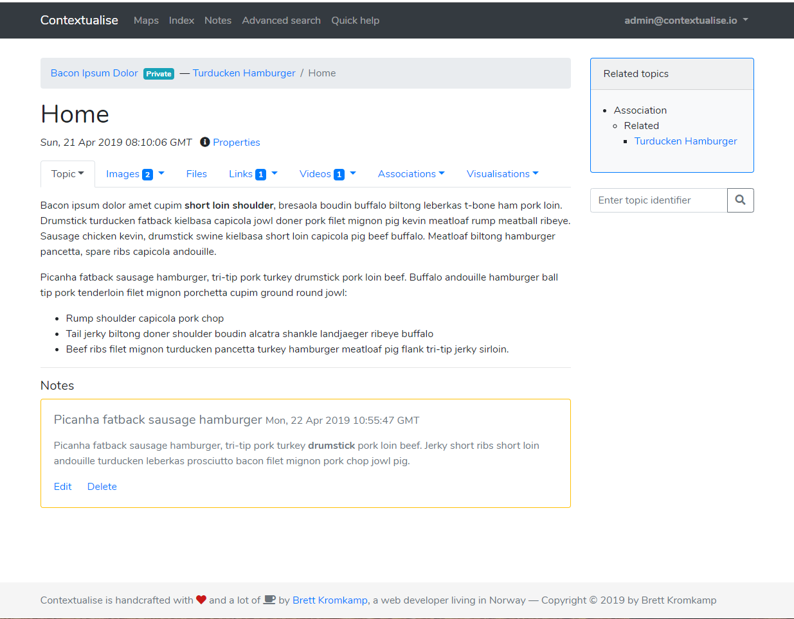

Contextualise by Brett Kromkamp
===============================

*Contextualise* is a simple, focused tool to help you to manage your personal knowledge. Contextualise’s
versatile underlying data structure, `topic maps`_, makes it straightforward to put your topics of interest and
relevant information resources into context which in turn allows you to expand your knowledge without the risk of it
becoming disjointed.

Contextualise is particularly suited for managing information-heavy projects and activities consisting of (semi)
unstructured and widely diverse data --- think of studying in general, investigative journalism, `world building`_ (for
books, movies or computer games) and many types of hobbies.

Contextualise's main dependency is `TopicDB`_, an open source topic maps-based graph library.

*Screen shot of Contextualise*

Why?
----

I built and published my first personal knowledge management system in 2007 which I still use, almost unmodified,
twelve years later: `Knowledge Management Using Topic Maps`_. If I remember correctly, it was built with
`PHP version 5.2.5`_! Twelve years is an eternity in software terms. Nowadays, my preferred choice for web development
is `Python`_ together with the `Flask`_ web development framework. What's more, after twelve years of using my own and
other knowledge management tools, I have several improvements in mind for the next version (many of which are
simplifications, for that matter). And perhaps one of the most important reasons for building a new personal management
system is that this time around I want it to be open source: both Contextualise (the web front-end application) and
`TopicDB`_ (the actual topic maps engine on top of which Contextualise is built --- also written by me) are licensed
with the permissive open source `MIT license`_.

Topic maps are both powerful and conceptually simple and provide the underpinnings for extremely flexible knowledge
management tools.

Feature Support
---------------

Pending.

Installation
------------

Contextualise officially supports Python 3.4–3.7.

Pending.

First-Time Use
--------------

Pending.

Tutorial
--------

Pending.

Documentation
-------------

Pending.

How to Contribute
-----------------

#. Check for open issues or open a fresh issue to start a discussion around a feature idea or a bug.
#. Fork `the repository`_ on GitHub to start making your changes to the **master** branch (or branch off of it).
#. Write a test which shows that the bug was fixed or that the feature works as expected.
#. Send a pull request and bug the maintainer until it gets merged and published. :) Make sure to add yourself to AUTHORS_.

.. _topic maps: https://msdn.microsoft.com/en-us/library/aa480048.aspx
.. _world building: https://en.wikipedia.org/wiki/Worldbuilding
.. _TopicDB: https://github.com/brettkromkamp/topic-db
.. _Knowledge Management Using Topic Maps: http://quesucede.com/page/show/id/frontpage
.. _PHP version 5.2.5: http://php.net/ChangeLog-5.php#5.2.5
.. _Python: https://www.python.org/
.. _Flask: http://flask.pocoo.org/docs/1.0/
.. _MIT license: https://github.com/brettkromkamp/contextualise/blob/master/LICENSE
.. _the repository: https://github.com/brettkromkamp/contextualise
.. _AUTHORS: https://github.com/brettkromkamp/contextualise/blob/master/AUTHORS.rst
