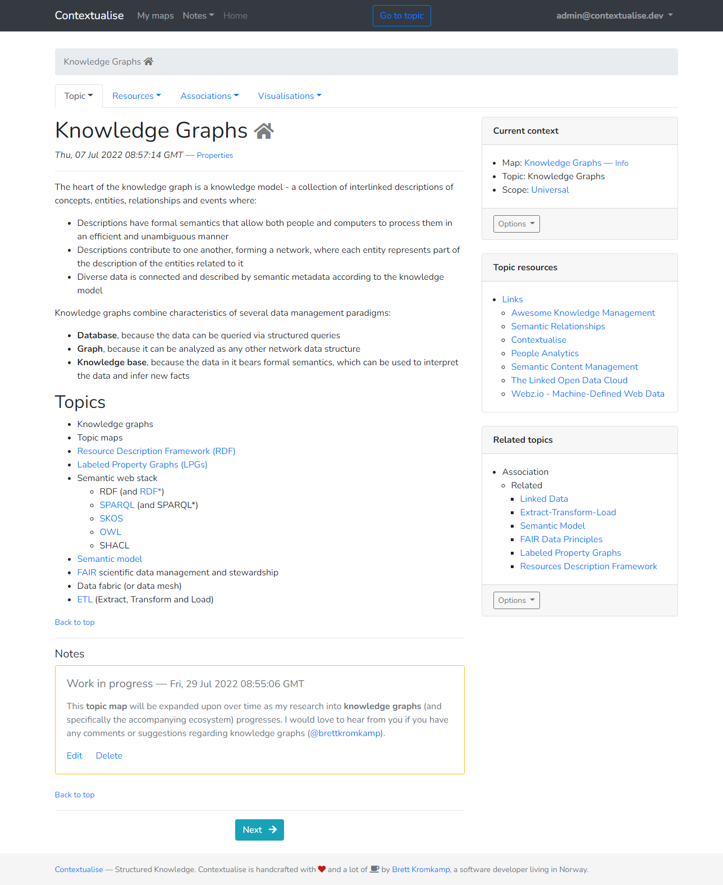

Contextualise by Brett Kromkamp
===============================

Contextualise is a simple and flexible tool particularly suited for organising information-heavy projects and
activities consisting of unstructured and widely diverse data and information resources -- think of
investigative journalism, personal and professional research projects, `world building`_ (for books, movies or computer
games) and many kinds of hobbies.

*Contextualise's topic view*

.. image:: resources/graph-view.png
   :alt: Contextualise's interactive network graph view (for navigation purposes)

*Contextualise's interactive network graph view (for navigation purposes)*

Contextualise's main dependency is `TopicDB`_, an open source `topic maps`_-based graph library. Topic maps provide
a way to describe complex relationships between abstract concepts and real-world (information) resources.

Why?
----

I built and published my first knowledge documentation tool in 2007 which I was still using until very recently, almost
unmodified, twelve years later. If I remember correctly, it was built with `PHP version 5.2.5`_! Twelve years is an
eternity in software terms. Nowadays, my preferred choice for web development is `Python`_ together with the `Flask`_
web development framework. What's more, after twelve years of using my own and other knowledge management tools, I have
several improvements in mind for the next version (many of which are simplifications, for that matter). And perhaps one
of the most important reasons for building a new tool like this is that I want it to be open source: both
Contextualise (the web application) and TopicDB (the actual topic maps engine on top of which Contextualise
is built -- also written by me) are licensed with the permissive open source `MIT license`_.

Feature Support
---------------

Pending.

Install the Development Version
-------------------------------

Contextualise officially supports Python 3.6–3.8.

If you have `Git <https://git-scm.com/>`_ installed on your system, it is possible to install the development version
of Contextualise.

Certain build prerequisites need to met including the presence of a C compiler, the Python
header files, the ``libpq`` header files and the ``pg_config`` program as outlined, here: `Build
prerequisites <http://initd.org/psycopg/docs/install.html#build-prerequisites>`_.

Then do::

    $ git clone https://github.com/brettkromkamp/contextualise
    $ cd contextualise
    $ pip install -e .

The ``pip install -e .`` command allows you to follow the development branch as it changes by creating links in the
right places and installing the command line scripts to the appropriate locations.

Then, if you want to update Contextualise at any time, in the same directory do::

    $ git pull

After having installed Contextualise, you would have to separately install and configure the PostgreSQL database. Brief
instructions on how to do so are provided, here: `Setting up the TopicDB
database <https://gist.github.com/brettkromkamp/87aaa99b056578ff1dc23a43a49aca89>`_. You need to ensure that the
database username, password and database name match with the ``settings.ini`` file in the project's root folder.

Finally, to run the application in **development** mode you need to change to the project's top-level directory and set
two environment variables followed by running the ``flask`` command with the ``run`` parameter::

    $ export FLASK_APP=contextualise
    $ export FLASK_ENV=development
    $ flask run

You should see something similar to the following in the terminal::

    * Serving Flask app "contextualise" (lazy loading)
    * Environment: development
    * Debug mode: on
    * Running on http://127.0.0.1:5000/ (Press CTRL+C to quit)
    * Restarting with stat
    * Debugger is active!
    * Debugger PIN: 521-258-444

Opening the browser and navigating to ``http://127.0.0.1:5000/`` should result in showing the application's *Welcome*
page.

*The Contextualise Welcome page*

Flask's built-in server is not suitable for production purposes. However, it is quite straightforward to run
Contextualise using `Gunicorn <https://gunicorn.org/>`_, a Python WSGI HTTP server::

    $ gunicorn -w 4 -b 0.0.0.0:5000 contextualise.wsgi:app

For further information for properly running a flask application in production, take a look at Flask's own
`documentation <https://flask.palletsprojects.com/en/1.1.x/deploying/#deployment>`_.

Docker
------

Support for running Contextualise within `Docker <https://www.docker.com/>`_ is still in development. To run it from the
root of a local clone of the source:

1. Create a ``settings.ini`` file in the root, for example::

    [DATABASE]
    Username = docker
    Password = docker
    Database = docker

    [EMAIL]
    Username = changeme
    Password = changeme
    Server = mail.changeme.com
    Sender = Change Me

2. Run ``docker image build -t brettkromkamp/contextualise .``
3. Run ``docker container run -it --rm -p 5000:5000 brettkromkamp/contextualise``

First-Time Use
--------------

Several users (with the roles of ``admin`` and ``user``, respectively) are created by the application for testing
purposes. To log in as the admin user, provide the following credentials:
``admin@contextualise.io`` (user name) and ``Passw0rd1`` (password). To log in as a non-admin user, provide the
following credentials: ``user@contextualise.io`` and ``Passw0rd1``.

Tutorial
--------

Pending.

Documentation
-------------

Pending.

Miscellaneous
-------------

Currently, I am using Contextualise for worldbuilding purposes of the Brave Robot fictional universe including its `Codex
Roboticus <https://brettkromkamp.com/posts/codex-roboticus/>`_.

.. image:: resources/codex-roboticus1.png
   :alt: Codex Roboticus

How to Contribute
-----------------

#. Check for open issues or open a fresh issue to start a discussion around a feature idea or a bug.
#. Fork `the repository`_ on GitHub to start making your changes to the **master** branch (or branch off of it).
#. Write a test which shows that the bug was fixed or that the feature works as expected.
#. Send a pull request and bug the maintainer until it gets merged and published. :) Make sure to add yourself to AUTHORS_.

.. _topic maps: https://msdn.microsoft.com/en-us/library/aa480048.aspx
.. _world building: https://en.wikipedia.org/wiki/Worldbuilding
.. _TopicDB: https://github.com/brettkromkamp/topic-db
.. _Knowledge Management Using Topic Maps: http://quesucede.com/page/show/id/frontpage
.. _PHP version 5.2.5: http://php.net/ChangeLog-5.php#5.2.5
.. _Python: https://www.python.org/
.. _Flask: http://flask.pocoo.org/docs/1.0/
.. _MIT license: https://github.com/brettkromkamp/contextualise/blob/master/LICENSE
.. _the repository: https://github.com/brettkromkamp/contextualise
.. _AUTHORS: https://github.com/brettkromkamp/contextualise/blob/master/AUTHORS.rst
