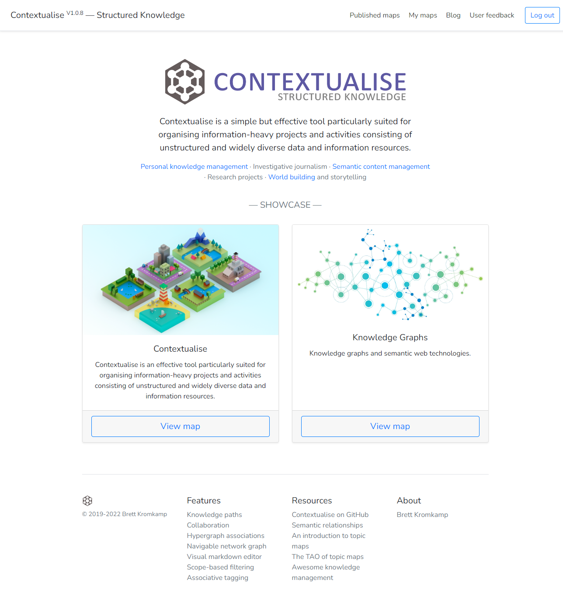

Contextualise: Structured Thought
=================================

Contextualise is a simple but effective tool particularly suited for organising information-heavy projects and
activities consisting of unstructured and widely diverse data and information resources -- think of investigative
journalism, personal and professional research projects, `world building`_ (for books, movies or computer games) and
many kinds of hobbies.

    On a side note, an **alpha** version of Contextualise is already available at `https://contextualise.dev <https://contextualise.dev/>`_.

    A Contextualise overview and tutorial is available as a Contextualise `topic map <https://contextualise.dev/topics/view/1/home>`_.

    Finally, check out the `Awesome Knowledge Management <https://github.com/brettkromkamp/awesome-knowledge-management>`_ resource, a curated
    list of amazingly awesome articles, people, projects, applications, software libraries and projects related to the knowledge management space.
    Alternatively, if you are interested in reading more in-depth articles in relation to knowledge management in general
    and Contextualise in particular, then check out my `blog <https://brettkromkamp.com/>`_.

**Contextualise's "My maps" view**

**Contextualise's topic view**

.. image:: resources/topic-view.png
   :alt: Contextualise's topic view

**Contextualise's navigable network graph view**

**Contextualise's interactive 3D viewer**

Contextualise's main dependency is `TopicDB`_, an open source `topic maps`_-based graph store. Topic maps provide
a way to describe complex relationships between abstract concepts and real-world (information) resources.

Why?
----

I built and published my first (topic maps-based) knowledge documentation tool in 2006 which I was still using until
quite recently, almost unmodified, fourteen years later. If I remember correctly, it was built with `PHP version 5.2.5`_!
Fourteen years is an eternity in software terms. Nowadays, my preferred choice for web development is `Python`_ together
with the `Flask`_ and `Django`_ web development frameworks. What's more, after fourteen years of using my own and other knowledge
management tools, I have several improvements in mind for the next version (many of which are simplifications, for that
matter). And perhaps one of the most important reasons for building a new tool like this is that I want it to be open
source: both Contextualise (the web application) and TopicDB (the actual topic maps engine on top of which Contextualise
is built -- also written by me) are licensed with the permissive open source `MIT license`_.

Feature Support
---------------
The following provides an overview of Contextualise's existing (and planned) feature set:

**Existing Features**

* Support for multiple (self-contained) topic maps
* Support for both private and public topic maps (the latter of which is not available to non-admin users until support to deal with `inappropriate content <https://github.com/brettkromkamp/contextualise/issues/9>`_ is in place)
* Extensive support for notes including the ability to attach a note to an existing topic and convert a note into a topic
* `Markdown`_-based text editor for topic text and notes
* The ability to attach files (including images, PDFs, and so forth) to topics
* The ability to attach (`glTF`_-based) 3D scenes to topics with an accompanying interactive 3D scene viewer
* Powerful (semantic) associations with the ability to create typed associations with role-based members
* Flexible filtering of base names, topic occurrences and associations by scope (that is, context)
* Navigable network graph visualisation of related topics
* Auto-complete on all form fields that expect a topic reference
* Google Docs-like `collaboration <https://brettkromkamp.com/posts/contextualise-collaboration/>`_; that is, being able to share topic maps with other Contextualise users for the purpose of collaboration in one of three ways: 1) **can view**, 2) **can comment** or 3) **can edit**
* Support for user-defined `knowledge paths <https://brettkromkamp.com/posts/knowledge-paths/>`_
* `Hypergraph <https://en.wikipedia.org/wiki/Hypergraph>`_ associations; that is, the ability to assert a relationship between more than two topics by means of a single association -- one edge joining multiple vertices
* `In place topic creation <https://brettkromkamp.com/posts/in-place-topic-creation/>`_
* Quick association creation for frictionless topic-linking and knowledge discovery
* Associative tagging
* `Augmented Reality <https://en.wikipedia.org/wiki/Augmented_reality>`_ (AR) support for 3D occurrences
* Syntax highlighing for numerous programming languages based on `Pygments <https://pygments.org/docs/>`_

**Features Currently in Development (August - September 2020)**

* Documentation (including tutorials)
* A topics index for each topic map with pagination and sorting (by name or modification date)

**Post Version 1.0 Features**

* Network graph visualisation filtering by association types
* Full-text search
* Google Maps support to see a topic within its geographical context on one hand and to be able to navigate between topics by means of a (geographic) map, on the other hand
* `Timeline <https://timeline.knightlab.com/docs/index.html>`_ support allowing for the navigation between topics using a visual timeline component
* WikiMedia API integration to automatically enhance existing topics with relevant information from `Wikipedia <https://www.wikipedia.org/>`_

For a more exhaustive list of planned features take a look at Contextualise's `list of issues <https://github.com/brettkromkamp/contextualise/issues>`_.

Install the Development Version
-------------------------------

Contextualise officially supports Python 3.6–3.9.

If you have `Git <https://git-scm.com/>`_ installed on your system, it is possible to install the development version
of Contextualise.

Certain build prerequisites need to be met including the presence of a C compiler, the Python
header files, the ``libpq`` header files and the ``pg_config`` program as outlined, here: `Build
prerequisites <http://initd.org/psycopg/docs/install.html#build-prerequisites>`_.

Then do::

    $ git clone https://github.com/brettkromkamp/contextualise
    $ cd contextualise
    $ pip install -e .

The ``pip install -e .`` command allows you to follow the development branch as it changes by creating links in the
right places and installing the command line scripts to the appropriate locations.

Then, if you want to update Contextualise at any time, in the same directory do::

    $ git pull

`TopicDB`_, the topic maps engine on top of which Contextualise is built is regularly updated. However, the version
of TopicDB published on `PyPI <https://pypi.org/project/topic-db/>`_ could lag behind. For that reason, it is
recommended that you also install TopicDB directly from GitHub::

    $ pip uninstall topic-db
    $ git clone https://github.com/brettkromkamp/topic-db.git
    $ cd topic-db
    $ pip install -e .

Then, if you want to update TopicDB at any time, in the same directory do::

    $ git pull

After installing Contextualise, you will have to separately install and configure the PostgreSQL database. Brief
instructions on how to do so are provided, here: `Setting up the TopicDB
database <https://gist.github.com/brettkromkamp/87aaa99b056578ff1dc23a43a49aca89>`_. You need to ensure that the
database username, password and database name match with the ``settings.ini`` file in the project's root folder.

Finally, to run the application in **development** mode you need to change to the project's top-level directory and set
two environment variables followed by running the ``flask`` command with the ``run`` parameter::

    $ export FLASK_APP=contextualise
    $ export FLASK_ENV=development
    $ flask run

You should see something similar to the following in the terminal::

    * Serving Flask app "contextualise" (lazy loading)
    * Environment: development
    * Debug mode: on
    * Running on http://127.0.0.1:5000/ (Press CTRL+C to quit)
    * Restarting with stat
    * Debugger is active!
    * Debugger PIN: 521-258-444

Opening the browser and navigating to ``http://127.0.0.1:5000/`` should result in showing something similar to the
application's *Welcome* page.

**The Contextualise Welcome page**

Flask's built-in server is not suitable for production purposes. However, it is quite straightforward to run
Contextualise using `Gunicorn <https://gunicorn.org/>`_, a Python `WSGI <https://en.wikipedia.org/wiki/Web_Server_Gateway_Interface>`_ HTTP server::

    $ gunicorn -w 4 -b 0.0.0.0:5000 contextualise.wsgi:app

For further information for properly running a flask application in production, take a look at Flask's own
`documentation <https://flask.palletsprojects.com/en/1.1.x/deploying/#deployment>`_.

Docker
------

Support for running Contextualise within `Docker <https://www.docker.com/>`_ is still in development. To run it from the
root of a local clone of the source:

1. Copy ``settings-docker-sample.ini`` to ``settings.ini`` file in the root and replace your email settings. For example::

    [DATABASE]
    Username = postgres
    Password = postgres
    Database = postgres
    Host = db
    Port = 5432

    [EMAIL]
    Username = changeme
    Password = changeme
    Server = mail.changeme.com
    Sender = Change Me

2. Run ``docker-compose up --build`` for a production like deployment running behind ``gunicorn`` in an immutable image
   so any source code changes require a rebuild. If, however, you want a more dynamic environment for development
   add in the development config file with ``docker-compose -f docker-compose.yml -f docker-compose.dev.yml up --build`` where source changes occur immediately within the image. Modifying ``requirements.txt`` requires a rebuild of the image however.

First-Time Use
--------------

Several users (with the roles of ``admin`` and ``user``, respectively) are created by the application for testing
purposes. To log in as the admin user, provide the following credentials:
``admin@contextualise.dev`` (user name) and ``Passw0rd1`` (password). To log in as a non-admin user, provide the
following credentials: ``user@contextualise.dev`` and ``Passw0rd1``.

Tutorial
--------

A Contextualise (work-in-progress) overview and tutorial is available as a Contextualise `topic map <https://contextualise.dev/topics/view/1/home>`_.

Documentation
-------------

Work in progress (July 16, 2020).

Miscellaneous
-------------

Currently, I am using Contextualise for, among others, worldbuilding purposes of the Brave Robot fictional universe including its `Codex
Roboticus <https://brettkromkamp.com/posts/codex-roboticus/>`_.

**The Codex Roboticus project**

.. image:: resources/codex-roboticus1.png
   :alt: The Codex Roboticus project

How to Contribute
-----------------

#. Check for open issues or open a fresh issue to start a discussion around a feature idea or a bug.
#. Fork `the repository`_ on GitHub to start making your changes to the **master** branch (or branch off of it).
#. Write a test which shows that the bug was fixed or that the feature works as expected.
#. Send a pull request and bug the maintainer until it gets merged and published. :) Make sure to add yourself to AUTHORS_.

Final Words
-----------
I hope you enjoy using Contextualise as much as I enjoy developing it. What's more,  I also  genuinely hope that Contextualise
can help you to improve your thinking process. If you have any suggestions, questions or critique with regards to Contextualise,
I would love to hear from you.

.. epigraph::
   *I will see you again, in the place where no shadows fall*.

   -- Ambassador Delenn, Babylon 5

.. _topic maps: https://msdn.microsoft.com/en-us/library/aa480048.aspx
.. _world building: https://en.wikipedia.org/wiki/Worldbuilding
.. _TopicDB: https://github.com/brettkromkamp/topic-db
.. _Knowledge Management Using Topic Maps: http://quesucede.com/page/show/id/frontpage
.. _PHP version 5.2.5: http://php.net/ChangeLog-5.php#5.2.5
.. _Python: https://www.python.org/
.. _Flask: http://flask.pocoo.org/docs/1.0/
.. _Django: https://www.djangoproject.com/
.. _MIT license: https://github.com/brettkromkamp/contextualise/blob/master/LICENSE
.. _the repository: https://github.com/brettkromkamp/contextualise
.. _AUTHORS: https://github.com/brettkromkamp/contextualise/blob/master/AUTHORS.rst
.. _Markdown: https://daringfireball.net/projects/markdown/syntax
.. _glTF: https://www.khronos.org/gltf/
